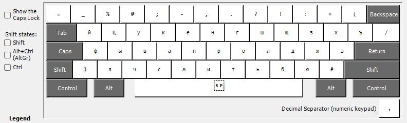
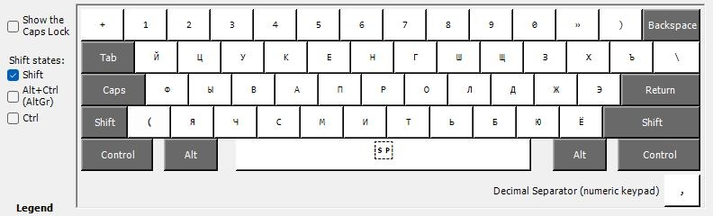
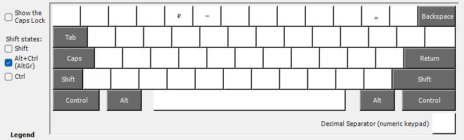
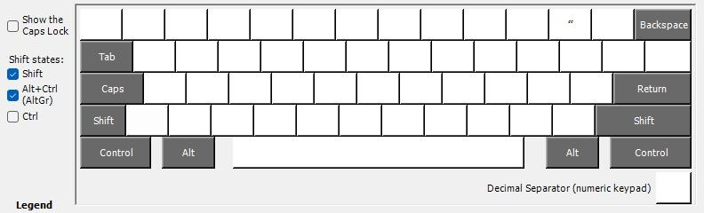

# The *Russian (Typography)* keyboard layout

A keyboard layout for the Russian language based on the *Russian (Typewriter)* layout that enhances typing experience and allows for more traditional typoghraphy characters such as the dash "—" or the quotes («»,„“).

## Installation

1. Download the `.zip` archive from the releases and extract it;
2. Execute setup.exe;
3. Head to the region and language settings on your version of Windows;
4. Change the ***Russian*** keyboard to the ***Russian (Typography)***.

Alternatively, you can build the keyboard layout yourself, provided you have Microsoft Keyboard Layout Creator.

## Gallery

No special keys held

`Shift` held

`AltGr`(`Ctrl + Alt`) held

`AltGr`(`Ctrl + Alt`) `+ Shift` held

